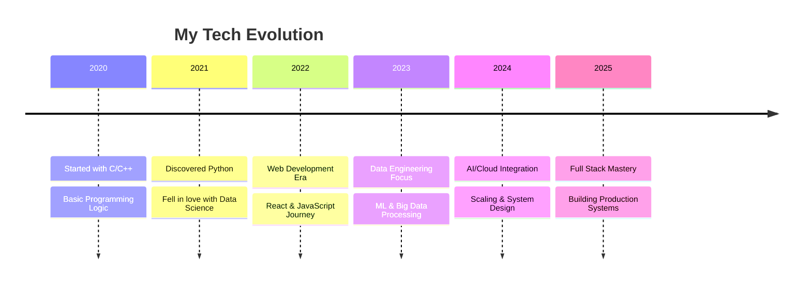
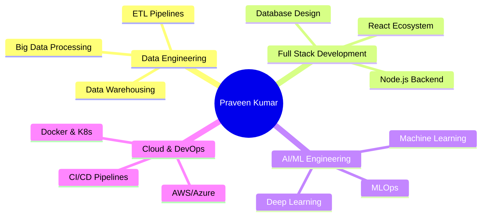

<div align="center">

# 🚀 **Welcome to My Digital Universe** 🌌

[](https://git.io/typing-svg)


<p align="center">
  
  
  
</p>

</div>

---

## 🎭 **About This Human** 


```javascript
const praveenKumar = {
    pronouns: "he/him",
    location: "🇮🇳 India",
    currentRole: "Full Stack Developer & Data Enthusiast",
    workingOn: ["AI/ML Systems", "Big Data Pipelines", "Scalable Applications"],
    learning: ["Advanced ML", "Cloud Architecture", "System Design"],
    askMeAbout: ["Python", "Data Science", "Web Development", "Linux"],
    funFact: "I debug with console.log() and I'm not ashamed! 😅",
    lifePhilosophy: "Code with passion, debug with patience, deploy with confidence",
    currentMood: "🔥 Building cool stuff!"
};
```

<details>
<summary>🎯 <b>My Coding Journey</b></summary>
<br>



</details>

---

## ⚡ **Tech Arsenal & Superpowers**

<div align="center">

### 🧠 **Programming Languages**
<p>
  
  
  
  
  
</p>

### 🌐 **Web Technologies**
<p>
  
  
  
  
  
</p>

### 🗄️ **Databases**
<p>
  
  
  
</p>

### 🤖 **Data Science & ML**
<p>
  
  
  
  
  
</p>

### 🛠️ **Tools & Platforms**
<p>
  
  
  
  
  
</p>

</div>

---

## 📊 **GitHub Stats & Analytics**

<div align="center">
  
</div>

<div align="center">
  
  
</div>

<div align="center">
  
</div>

---

## 🏆 **Achievements & Trophies**

<div align="center">
  
</div>

---

## 🎯 **Current Focus Areas**

<div align="center">



</div>

---

## 🚀 **Featured Projects**

<div align="center">

<table>
<tr>
<td width="50%">

### 🤖 **AI-Powered Data Analytics**
[](https://github.com/your-username/ai-data-analytics)

**Tech Stack:** Python, TensorFlow, Pandas, Flask
- Advanced ML algorithms for data insights
- Real-time analytics dashboard
- 95% accuracy in predictions

</td>
<td width="50%">

### 🌐 **Full Stack E-Commerce Platform**
[](https://github.com/your-username/ecommerce-platform)

**Tech Stack:** React, Node.js, MongoDB, Express
- Scalable microservices architecture
- Real-time payment processing
- Mobile-responsive design

</td>
</tr>
<tr>
<td width="50%">

### 📊 **Big Data Processing Engine**
[](https://github.com/your-username/big-data-engine)

**Tech Stack:** Python, Apache Spark, Kafka
- Processes 1M+ records per minute
- Real-time data streaming
- Fault-tolerant architecture

</td>
<td width="50%">

### 🎮 **Interactive Data Visualizer**
[](https://github.com/your-username/data-visualizer)

**Tech Stack:** JavaScript, D3.js, React, WebGL
- 3D interactive charts and graphs
- Real-time data updates
- Export capabilities

</td>
</tr>
</table>

</div>

---

## 💡 **Skills Radar**

<div align="center">

```mermaid
%%{init: {'theme':'dark'}}%%
radar
    title Skills Assessment
    x-axis "Beginner" : "Intermediate" : "Advanced" : "Expert"
    y-axis "Python" : "JavaScript" : "React" : "Data Science" : "Machine Learning" : "System Design" : "Cloud Computing" : "DevOps"
    "Python" : [1, 2, 3, 4]
    "JavaScript" : [1, 2, 3, 3]
    "React" : [1, 2, 3, 3]
    "Data Science" : [1, 2, 3, 4]
    "Machine Learning" : [1, 2, 3, 3]
    "System Design" : [1, 2, 2, 3]
    "Cloud Computing" : [1, 2, 2, 2]
    "DevOps" : [1, 2, 2, 2]
```

</div>

---

## 🎮 **Interactive Zone**

<div align="center">

### 🐍 **GitHub Contribution Snake**
<picture>
  <source media="(prefers-color-scheme: dark)" srcset="https://raw.githubusercontent.com/your-username/your-username/output/github-contribution-grid-snake-dark.svg">
  <source media="(prefers-color-scheme: light)" srcset="https://raw.githubusercontent.com/your-username/your-username/output/github-contribution-grid-snake.svg">
  
</picture>

### 💎 **Random Dev Wisdom**


### 🎵 **Currently Vibing To**
[](https://spotify-github-profile.vercel.app/api/spotify-playing)

</div>

---

## 📈 **Weekly Development Breakdown**

<!--START_SECTION:waka-->
```text
Python       8 hrs 42 mins   ████████████▓░░░░░░░░░░░░   50.23 %
JavaScript   3 hrs 15 mins   ████▓░░░░░░░░░░░░░░░░░░░░   18.79 %
React        2 hrs 30 mins   ███▓░░░░░░░░░░░░░░░░░░░░░   14.45 %
SQL          1 hr 25 mins    ██░░░░░░░░░░░░░░░░░░░░░░░   08.22 %
Other        1 hr 23 mins    ██░░░░░░░░░░░░░░░░░░░░░░░   08.31 %
```
<!--END_SECTION:waka-->

---

## 🌐 **Connect & Collaborate**

<div align="center">

<a href="https://www.linkedin.com/in/k-praveen-kumar-6223aa280">
  
</a>
<a href="https://x.com/Praveenk_23">
  
</a>
<a href="mailto:your-email@example.com">
  
</a>
<a href="https://your-portfolio.com">
  
</a>

### 💬 **"Innovation distinguishes between a leader and a follower"** - Steve Jobs


</div>

---

<div align="center">

### 🎯 **Let's Build Something Amazing Together!**


**🔥 Always Coding • 🚀 Always Learning • 💡 Always Innovating**

<sub>Made with 💖 and lots of ☕</sub>

*Last updated: May 2025*

</div>

<div align="center">


</div>
