# 🌟 Hey there! I'm **K Praveen Kumar** 

<div align="center">
  
[](https://git.io/typing-svg)

</div>

<div align="center">
  
</div>

---

## 🎯 **About Me**

```yaml
name: "K Praveen Kumar"
located_in: "India"
current_focus: ["Machine Learning", "Data Engineering", "Full Stack Development"]
learning: ["Big Data Processing", "AI/ML Systems", "Cloud Architecture"]
hobbies: ["Tech Exploration", "Anime", "Problem Solving"]
fun_fact: "I turn coffee into code and data into insights ☕➡️💻"
```

<div align="right">
  
</div>

---

## ⚡ **Tech Arsenal**

<div align="center">

### 🧠 **Core Programming**
<p>
  
</p>

### 🌐 **Web & Backend**
<p>
  
</p>

### 🛠️ **Data & ML**
<p>
  
  
  
  
</p>

### ⚙️ **Tools & Platforms**
<p>
  
</p>

</div>

---

## 📊 **GitHub Analytics**

<div align="center">
  
  
</div>

<div align="center">
  
</div>

---

## 🚀 **Current Journey**

<div align="center">

| 🎯 **Focus Areas** | 📚 **Learning** | 🔥 **Interests** |
|:------------------:|:---------------:|:-----------------:|
| Data Engineering | Big Data Systems | AI/ML Research |
| Full Stack Dev | Cloud Architecture | System Design |
| Problem Solving | DevOps Practices | Open Source |

</div>

---

## 🏆 **Achievements & Highlights**

```mermaid
graph LR
    A[🎓 Learning] --> B[💻 Building]
    B --> C[🚀 Deploying]
    C --> D[📈 Scaling]
    D --> A
    
    style A fill:#ff9999
    style B fill:#66b3ff
    style C fill:#99ff99
    style D fill:#ffcc99
```

<div align="center">
  
</div>



---

## 🎮 **Fun Zone**

<div align="center">

### 🐍 **Watch the Snake eat my contributions!**


### 💫 **Random Dev Quote**


</div>

---

## 🤝 **Let's Connect & Collaborate!**

<div align="center">

[](https://www.linkedin.com/in/k-praveen-kumar-6223aa280)
[](https://x.com/Praveenk_23)
[](mailto:your-email@example.com)

### 💬 **"Building the future, one line of code at a time"**

</div>

---

<div align="center">
  
### ⭐ **If you find my work interesting, consider starring my repositories!**


**🎯 Always Learning • 🚀 Always Building • 💡 Always Innovating**

*Last updated: 2025*

</div>
